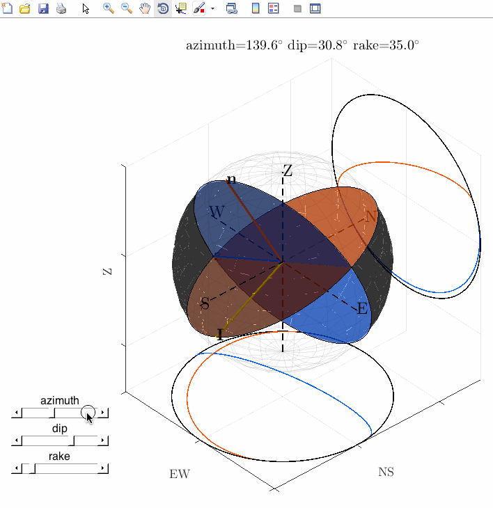

# Focal sphere

Focal sphere imaging software for matlab.

## Description

***DEMO (GIF Animation):***

## Features
 - Plot the focal sphere in 3D and its vertical and horizontal projections simultaneously.
 - Input specific azimuth, dip and the rake (or slip angle) as arguments.
 - Rotate a fault with GUI sliders.

## Requirement
[MATLAB](http://www.mathworks.com/products/matlab)
## Usage
Just run this function with arguments.

***Example***
	
	>> Focalsphere(30,60,30)

Without arguments, it is plotted with sample angles.

***Example***
	
	>> Focalsphere()

## Installation
Type this command on your terminal.

	$ git clone https://github.com/kurakulucky/Focalsphere.git
## Author
[kurakulucky](https://github.com/kurakulucky)
## License
[GNU GENERAL PUBLIC LICENSE](https://www.gnu.org/licenses/gpl-3.0.html)

